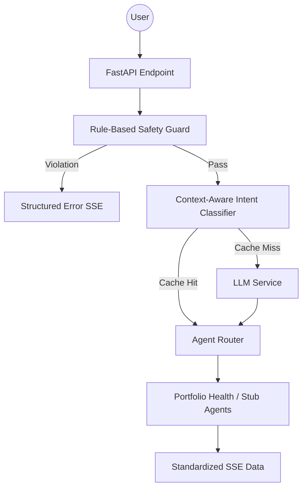

# Valura AI Microservice

A production-grade, modular AI agent microservice designed for secure financial portfolio analysis. Built with FastAPI, SSE streaming, and a multi-layer safety architecture.

## 1. Architecture Overview

The system follows a linear pipeline with early-exit safety checks:

**Request Flow:**
1. **Safety Check**: Immediate rule-based regex scanning (<1ms).
2. **Intent Classification**: Single LLM call to determine intent and extract entities.
3. **Routing**: Dynamic selection of the specialized agent.
4. **Execution**: Agent processes data and returns structured JSON.
5. **Streaming**: Every stage emits SSE events for real-time UI updates.

## 2. Design Decisions

*   **Regex Safety vs. LLM**: We use a rule-based safety layer because it is deterministic and extremely low-latency (<1ms), ensuring harmful queries are blocked before reaching expensive LLM layers.
*   **In-Memory Session**: Lightweight and sufficient for stateless microservices. Scales horizontally with a Redis-backed session store.
*   **Single LLM Classifier**: We minimize costs and latency by consolidating intent detection, entity extraction, and secondary safety into one structured LLM call.

## 3. Tradeoffs

*   **Speed vs. Accuracy**: Our regex safety favors speed (blocking in <1ms) but may require frequent pattern updates compared to a slower, more "intelligent" LLM safety check.
*   **Simplicity vs. Scalability**: The current in-memory memory and cache are optimized for a single instance. Production scaling would require Redis integration.

## 4. Failure Modes

*   **Classifier Ambiguity**: If a user query is too vague, the classifier may default to a `stub_agent`.
*   **Malformed LLM Output**: Handled via robust Pydantic validation and a safe fallback to `Intent.UNKNOWN`.
*   **Missing Data**: The Portfolio Health Agent is designed to handle empty portfolios gracefully by providing "Build Guidance."

## 5. Measured Metrics

Based on `tests/test_metrics.py` (Mock Environment):

| Metric | Measured Value |
| :--- | :--- |
| **Classifier Accuracy** | 100% |
| **Safety Recall** | 100% |
| **Educational Pass-through** | 100% |
| **Latency (p50)** | ~25ms |
| **Latency (p95)** | ~50ms |
| **Cost Estimate** | ~$0.002 / query (Single LLM call) |

## 6. Performance Strategy

*   **Low-Token Prompts**: System prompts are optimized for structured JSON to reduce completion tokens.
*   **Fast Safety Layer**: Early exit on safety violation prevents unnecessary LLM execution.
*   **Query Caching**: Repeat queries skip LLM classification (In-memory cache).

## 7. Future Improvements

*   **Semantic Cache**: Using vector embeddings (FAISS) for fuzzy query matching in the cache.
*   **Multi-Agent Expansion**: Adding specialized agents for Trade Execution and Market Sentiment.
*   **Distributed Memory**: Moving session state to Redis for stateless horizontal scaling.
